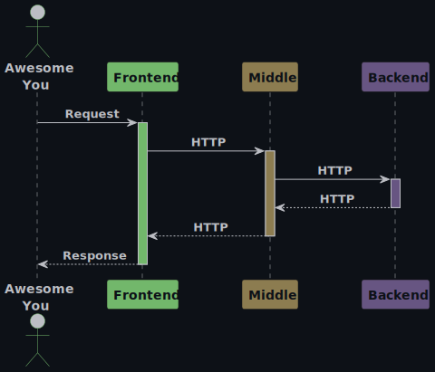
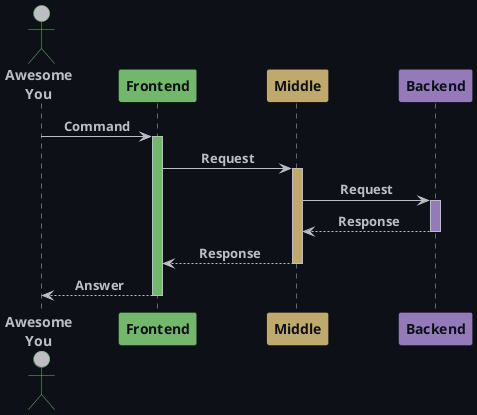

<div style="text-align: center;">
    
</div>
<h1><a name="up">Telegram-bot // Frontend</a></h1>

Часть приложения `Мини-банк` − telegram-бот, с которым будет взаимодействовать пользователь.

---

## Как запустить

### Подготовка к запуску
Перед запуском приложения нужно добавить две переменные среды: 
- `TG_NAME_GPB` − имя бота без знака @;
- `TG_TOKEN_GPB` − токен бота.

При создании в поле со значением переменной вписать свое значение.
<details>
<summary>Откуда брать значения</summary>

>Если уже _есть_ готовый бот, в значения переменных вписать его имя и токен. \
Если бота _нет_, создать его с помощью [@BotFather](https://t.me/BotFather), 
затем в значения переменных среды вписать его имя и токен.

</details>

### Запуск
После добавления переменных среды можно запускать приложение.
Для этого нужно:
1. Склонировать проект:
```
git clone https://github.com/gpb-it-factory/molchanova-telegram-bot
```
#### Запуск с помощью консоли
2. Открыть консоль и перейти в директорию проекта
   (в папку `molchanova-telegram-bot`).
3. Собрать проект, прописав следующую команду:
   - Windows:
   ```
   .\gradlew.bat build
   ```
   - Linux/Mac:
   ```
   .\gradlew build
   ```
4. Запустить проект, прописав следующую команду (для Spring Boot приложения):
   - Windows:
   ```
   .\gradlew.bat bootRun
   ```
   - Linux/Mac:
   ```
   .\gradlew bootRun
   ```
   **Готово!**

#### Запуск с помощью IDEA
2. Открыть в IDEA проект (папку `molchanova-telegram-bot`).
3. Запустить проект из IDEA, нажав волшебную кнопочку. \
   **Готово!**

## Общая архитектура
### Описание

#### 1. Frontend
Telegram-бот. Клиентское приложение, инициирует запросы пользователей.

#### 2. Middle
Java-сервис. Принимает запросы от пользователя, выполняет валидацию и бизнес-логику, маршрутизирует их в `Backend` и отправляет ответ.

#### 3. Backend
Автоматизированная банковская система. Обрабатывает транзакции, хранит клиентские данные.

### Схема
Описание архитектуры можно представить в виде краткой схемы ниже:\
\


<details>
<summary>Код PlantUML схемы</summary>



</details>

## Планы на будущее
- **Добавить следующие команды**:
  - `/regitser` − регистрация пользователя;
  - `/createaccount` − открытие счета;
  - `/currentbalance` − запрос текущего баланса;
  - `/transfer [toTelegramUser] [amount]` − перевод средств другому пользователю.

## Контакты
Связаться со мной можно через:
- [GitHub](https://github.com/molchmd): molchmd
- [Telegram](https://t.me/molchmd): @molchmd

---

[](#up)