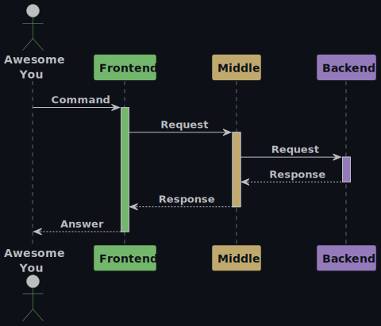

    

<h1><a name="up">Telegram-bot // Frontend</a></h1>

Часть приложения `Мини-банк` − telegram-бот, с которым будет взаимодействовать пользователь.

---

## Общая архитектура
### Описание

#### 1. Frontend
Telegram-бот. Клиентское приложение, инициирует запросы пользователей.

#### 2. Middle
Java-сервис. Принимает запросы от пользователя, выполняет валидацию и бизнес-логику, маршрутизирует их в `Backend` и отправляет ответ.

#### 3. Backend
Автоматизированная банковская система. Обрабатывает транзакции, хранит клиентские данные.

### Схема
Описание архитектуры можно представить в виде краткой схемы ниже:\
\

Код PlantUML схемы

---

